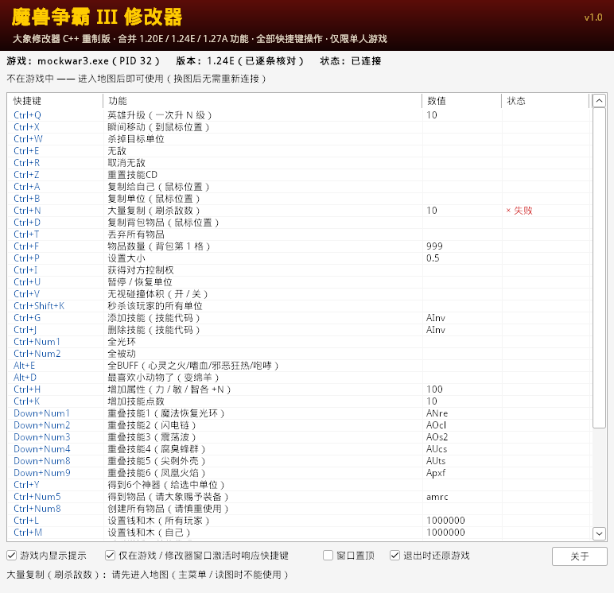

# 魔兽争霸 III 修改器（大象修改器 C++ 重制版）

把三个原版修改器的功能合并成一个 C++ 程序：

| 原版 | 实现方式 | 本版处理 |
|---|---|---|
| war3 1.24E修改器V1.6by大象 | Cheat Engine 生成，内嵌明文自动汇编脚本 | 脚本里的 28 个条目全部重写为 C++，默认快捷键完全一致 |
| war3 1.20e修改器V3.04by大象 | 同上 | 1.24E 版没有的条目（重叠技能、全BUFF、变羊、创建所有物品、光环叠加、英雄最大等级）移植到 1.24E |
| 魔兽争霸1.27终极版（易语言） | 代码被混淆 | 按功能清单用 JASS 原生函数实现单人可用的部分（暂停单位、无视碰撞、属性、技能点、经验倍率、秒杀玩家单位、无CD无蓝耗、暂停游戏等） |

* **当前版本：1.24E 完整支持**（所有地址逐条反汇编核对，补丁在真实 Game.dll 上测试过）。
* 架构按全版本设计：JASS 原生函数表已覆盖 17 个版本，换版本需补充补丁地址和 `InitManualOffsets()` 中的内部函数 / 数据地址（见“增加新版本”）。
* 界面仿原版 CE 修改器：一行一个功能，“快捷键 | 功能 | 数值 | 状态”，**全部功能都能用快捷键在游戏里直接触发**。
* 只用于单人游戏：检测到多人游戏（超过一个真人玩家）时自动停用，与游戏自带作弊码的适用范围一致，也避免多人游戏不同步掉线。
  常驻开关只能在单人游戏进行中开启，退出游戏 / 换图 / 检测到多人游戏时自动全部关闭，补丁不会带进下一局。



---

## 一、使用方法

1. 把 `bin\War3Trainer.exe` 和 `bin\War3Trainer.dll` 放在同一个目录；
2. 启动魔兽争霸 1.24E 和修改器（顺序随意；修改器会申请管理员权限，请点“是”）；
3. 修改器每 0.5 秒自动查找游戏，找到后自动加载模块，第一行显示“版本：1.24E（已逐条核对）状态：已连接”；
   在主菜单时第二行显示“不在游戏中”，这是正常的；
4. 进入地图，在游戏里框选一个单位，按快捷键即可。复制、移动、创建物品等以**鼠标所指的位置**为准；
   命令在游戏画下一帧时执行，所以要在对局画面里使用（窗口最小化时第二行会提示“游戏画面没有在刷新”）；
5. 换图、重新开始都不需要重新连接；常驻开关在退出这一局时会自动关闭，下一局需要时再按一次。

列表里的操作：

| 操作 | 作用 |
|---|---|
| 双击“功能”列 / 选中后按回车 | 执行该功能（常驻开关为开 / 关） |
| 单击“数值”列 | 修改数值，回车确认、Esc 取消，立即保存 |
| 单击“快捷键”列 | 按下新的组合键（最多 3 个普通键 + Ctrl/Alt/Shift），Esc 取消，Backspace 清除；与其它行重复时自动从其它行移除。只接受在修改器窗口里按的键，点到别处或切换窗口即取消 |
| 右键 | 执行 / 修改快捷键 / 清除 / 恢复默认快捷键 / 修改数值 / 恢复默认数值 |

底部选项：

* **游戏内显示提示**：执行结果同时显示在游戏画面左侧；
* **仅在游戏 / 修改器窗口激活时响应快捷键**（默认开）：在别的程序里打字时不会误触发；
* **窗口置顶**；
* **退出时还原游戏**（默认开）：关闭修改器时还原所有代码补丁并卸载模块。

快捷键和数值保存在 exe 同目录的 `War3Trainer.ini`（第一次运行自动生成，也可以手工编辑，写法同列表显示，
兼容原版的 `Ctrl+numeric 1`、`Down Arrow+numeric 1` 写法）。小键盘快捷键需要打开 NumLock。

## 二、功能与快捷键

默认快捷键沿用原版：1.24E V1.6 的 `Ctrl+Q`…`Ctrl+numeric 7`、`Home`/`End`，1.20E V3.04 的 `Ctrl+numeric 8/9`、
`Down+numeric`、`Alt+E`、`Alt+D`、`Alt+numeric 1`；1.27A 的功能原版没有快捷键，补上了不冲突的组合键。

**单位（先在游戏里框选一个单位，复制 / 移动类功能以鼠标位置为准）**

| 快捷键 | 功能 | 默认数值 | 来源 |
|---|---|---|---|
| `Ctrl+Q` | 英雄升级（一次升 N 级） | 10 | 原版 1.24E Ctrl+Q：SetHeroLevel 逐级提升 |
| `Ctrl+X` | 瞬间移动（到鼠标位置） | — | 原版 Ctrl+X：SetUnitPosition |
| `Ctrl+W` | 杀掉目标单位 | — | 原版 Ctrl+W：KillUnit |
| `Ctrl+E` | 无敌 | — | 原版 Ctrl+E：SetUnitInvulnerable(true) |
| `Ctrl+R` | 取消无敌 | — | 原版 Ctrl+R：SetUnitInvulnerable(false) |
| `Ctrl+Z` | 重置技能CD | — | 原版 Ctrl+Z：UnitResetCooldown |
| `Ctrl+A` | 复制给自己（鼠标位置） | — | 原版 Ctrl+A：复制选中单位给自己 |
| `Ctrl+B` | 复制单位（鼠标位置） | — | 原版 Ctrl+B：复制给单位原来的主人 |
| `Ctrl+N` | 大量复制（刷杀敌数） | 10 | 原版 Ctrl+N：一次复制 N 个（最多 500） |
| `Ctrl+D` | 复制背包物品（鼠标位置） | — | 原版 Ctrl+D：背包 6 格物品各复制一份 |
| `Ctrl+T` | 丢弃所有物品 | — | 原版 Ctrl+T |
| `Ctrl+F` | 物品数量（背包第 1 格） | 999 | 原版 Ctrl+F：SetItemCharges |
| `Ctrl+P` | 设置大小 | 0.5 | 原版 Ctrl+P：SetUnitScale |
| `Ctrl+I` | 获得对方控制权 | — | 原版 Ctrl+I：选中单位所属玩家对你共享完全控制权 |
| `Ctrl+U` | 暂停 / 恢复单位 | — | 1.27A：暂停单位 |
| `Ctrl+V` | 无视碰撞体积（开 / 关） | — | 1.27A：无视碰撞体积，再按一次恢复 |
| `Ctrl+Shift+K` | 秒杀该玩家的所有单位 | — | 1.27A：选中对方任意一个单位，杀死该玩家全部单位 |

**英雄 / 技能**

| 快捷键 | 功能 | 默认数值 | 来源 |
|---|---|---|---|
| `Ctrl+G` | 添加技能（技能代码） | AInv | 原版 Ctrl+G：添加后设为最高等级 |
| `Ctrl+J` | 删除技能（技能代码） | AInv | 原版 Ctrl+J：UnitRemoveAbility |
| `Ctrl+Num1` | 全光环 | — | 原版 Ctrl+numeric 1：辉煌 / 专注 / 耐久 / 邪恶 / 吸血 / 强击 / 命令 / 治疗守卫 |
| `Ctrl+Num2` | 全被动 | — | 原版 Ctrl+numeric 2：物品栏 / 重击 / 致命一击 / 醉拳 |
| `Alt+E` | 全BUFF（心灵之火/嗜血/邪恶狂热/咆哮） | — | 1.20E Alt+E：用隐形施法单位施放增益 |
| `Alt+D` | 最喜欢小动物了（变绵羊） | — | 1.20E Alt+D：把选中单位变成绵羊 |
| `Ctrl+H` | 增加属性（力 / 敏 / 智各 +N） | 100 | 1.27A：设置属性 |
| `Ctrl+K` | 增加技能点数 | 10 | 1.27A：增加技能点数 |

**重叠技能（同一技能重复添加 10 次；光环类不会叠加效果）**

| 快捷键 | 功能 | 默认数值 | 来源 |
|---|---|---|---|
| `Down+Num1` | 重叠技能1（魔法恢复光环） | ANre | 1.20E Down Arrow+numeric 1 |
| `Down+Num2` | 重叠技能2（闪电链） | AOcl | 1.20E Down Arrow+numeric 2 |
| `Down+Num3` | 重叠技能3（震荡波） | AOs2 | 1.20E Down Arrow+numeric 3 |
| `Down+Num4` | 重叠技能4（腐臭蜂群） | AUcs | 1.20E Down Arrow+numeric 4 |
| `Down+Num8` | 重叠技能5（尖刺外壳） | AUts | 1.20E Down Arrow+numeric 8 |
| `Down+Num9` | 重叠技能6（凤凰火焰） | Apxf | 1.20E Down Arrow+numeric 9 |

**物品 / 资源 / 科技**

| 快捷键 | 功能 | 默认数值 | 来源 |
|---|---|---|---|
| `Ctrl+Y` | 得到6个神器（给选中单位） | — | 原版 Ctrl+Y：4 把瑟拉思尔 + 火焰手套 + 远古战斧 |
| `Ctrl+Num5` | 得到物品（请大象赐予装备） | amrc | 原版 Ctrl+numeric 5：在鼠标位置创建物品 |
| `Ctrl+Num8` | 创建所有物品（请慎重使用） | — | 1.20E Ctrl+numeric 8：在鼠标位置创建全部物品 |
| `Ctrl+L` | 设置钱和木（所有玩家） | 1000000 | 原版 Ctrl+L：所有玩家 100 万金钱和木材 |
| `Ctrl+M` | 设置钱和木（自己） | 1000000 | 1.27A：增加金币木材 |
| `Ctrl+Num4` | 呼叫增援（单位代码） | nbel | 原版 Ctrl+numeric 4：在鼠标位置创建单位给自己 |
| `Ctrl+Num6` | 得到科技（科技代码） | Rhde | 原版 Ctrl+numeric 6：SetPlayerTechResearched |
| `Ctrl+Num0` | 经验获取率（倍数） | 10 | 1.27A：增加经验获取率，1 = 正常 |

**游戏**

| 快捷键 | 功能 | 默认数值 | 来源 |
|---|---|---|---|
| `Home` | 关闭战争迷雾（MapON） | — | 原版 Home：FogEnable(false) / FogMaskEnable(false)，效果等同作弊码 iseedeadpeople |
| `End` | 恢复战争迷雾（MapOFF） | — | 原版 End |
| `Pause` | 暂停 / 继续游戏 | — | 1.27A：暂停游戏 / 恢复游戏 |

**常驻开关（按一次开启，再按一次关闭；只能在单人游戏进行中开启，离开这一局自动关闭）**

| 快捷键 | 功能 | 默认数值 | 来源 |
|---|---|---|---|
| `Ctrl+Num3` | 不会失败 | — | 原版 Ctrl+numeric 3：IsNoDefeatCheat 恒为真 |
| `Ctrl+Num7` | 娱乐模式（快速建造/建筑可重叠/人口65535） | — | 原版 Ctrl+numeric 7；人口上限开启时立即对所有玩家生效，关闭时还原 |
| `Ctrl+Num9` | 允许光环叠加 | — | 1.20E Ctrl+numeric 9 |
| `Alt+Num1` | 英雄最大等级 | 100000 | 1.20E Alt+numeric 1：英雄最大等级10W |
| `Alt+Num2` | 选中单位无CD无蓝耗 | — | 1.27A：无CD无蓝耗（对当前选中的单位持续生效） |

说明：

* 数值类型：整数、小数，或 4 字符代码（单位 / 技能 / 物品 / 科技代码，区分大小写，在地图编辑器里查看）。
* “全BUFF / 变绵羊”：原版 1.20E 直接构造技能对象调用虚函数，版本间不通用（1.24E 原版因此删掉了这两项）。
  本版改用隐形施法单位施放（优先用野怪版本技能 `ACif/ACbl/ACuf/ACro/ACpy`，没有再用普通版本），
  全部是 JASS 原生函数，但**还没有在真实游戏中测试**。
* “秒杀该玩家的所有单位”选中的是自己的单位时会拒绝执行。

## 三、工作原理

```
War3Trainer.exe（界面）                     war3.exe（游戏进程）
  │ 1. 查找窗口类 "Warcraft III"                │
  │ 2. OpenProcess + CreateRemoteThread(LoadLibraryW)
  ├───────────────────────────────────────────>│ 3. War3Trainer.dll 初始化线程：
  │                                            │    等 Game.dll → 读文件版本 → 偏移表
  │                                            │    创建共享内存 Local\War3Trainer_Shm_<PID>
  │                                            │    挂钩“世界画面每帧调用的函数”（与原版相同，1.24E game.dll+4D3E30）
  │ 4. 快捷键 → 写命令到共享内存环形槽          │
  │    （只写内存，不发任何窗口消息）           │
  ├───────────────────────────────────────────>│ 5. 游戏画下一帧时，在游戏线程里取出命令执行
  │                                            │    aero::generic_c_call(Offset(NATIVE_xxx), ...)
  │<───────────────────────────────────────────┤ 6. 结果（16 条环形区）/ 选中单位 / 开关状态写回共享内存
                                                 7. 主菜单 / 读图时没有帧：模块后台线程回复“请先进入地图”，
                                                    退出对局时还原代码补丁（不调用任何游戏函数）
```

与原版的对比：

| 原版 CE 修改器 | 本版 |
|---|---|
| 信箱写死在 `war3.exe+70000`，`fullaccess()` 改页属性 | 命名共享内存，与版本无关 |
| Hook 每帧调用的函数（1.24E `game.dll+4D3E30`，各版本不同） | 同一个挂钩点（18 个版本都用特征码定位好了，见 `docs/地址核对.md`）。存根先执行被覆盖的原指令，再按返回地址只处理“每帧函数”那一次调用；安装 / 卸下用 8 字节原子写入，游戏运行中操作也安全。早期版本曾改用窗口消息，实测在真实游戏里收不到消息，已放弃 |
| 全局单位组反复使用，换图后可能失效 | 每次 `CreateGroup` / `DestroyGroup` |
| `Location` + `CreateUnitAtLoc`，每次泄漏一个 location | 直接用坐标 `CreateUnit` |
| 出错就是游戏崩溃 | 每条命令都在异常保护里执行，出错只让这条命令失败；补丁写入前逐字节校验原始字节 |

## 四、代码结构与规范

```
src/common/Shared.h        界面与模块之间的通信协议（命令号、开关号、共享内存结构）
src/dll/                   注入模块 War3Trainer.dll
  Offsets.h / .cpp           偏移编号 + OffsetSet(编号, 版本, RVA) 地址表（同 TuringY 写法）
  NativeOffsets.inc          JASS 原生函数 17 个版本的地址（tools/gen_offsets.py 从 TuringY 生成）
  GlobalOffsets.inc          全局对象地址（同上）
  GameStructs.h              war3:: 结构体（CGameWar3 / CGameUI / CWorldFrameWar3 / ItemDataHashTable）
  Jass.h / .cpp              JASS 原生函数包装：aero::generic_c_call<T>(Offset(NATIVE_xxx), ...)
  Tools.h / .cpp             GameUIObjectGet / GameUIField / 鼠标坐标 / 游戏内文字
  Patch.h / .cpp             常驻开关的代码补丁表与英雄最大等级挂钩
  Trainer.h / .cpp           每个功能的实现（注释写明对应原版脚本哪一段）
  Bridge.h / .cpp            共享内存、每帧挂钩入口、后台线程（心跳 / 对局外代为回复 / 卸载）
  SafeCall.h / .cpp          异常保护（MSVC 用 __try；MinGW 手工注册 SEH 帧）
src/gui/                   界面 War3Trainer.exe
  Rows.cpp                   功能表（名称 / 默认快捷键 / 数值）
  Hotkey.cpp                 快捷键解析与后台轮询（GetAsyncKeyState，与 CE 相同，不占用系统热键）
  GameLink.cpp               查找游戏 / 注入 / 共享内存 / 投递命令
  MainWindow.cpp             主窗口
include/fp_call.h          aero 调用库（来自 TuringY，补了 MinGW 支持）
tests/                     自测程序、模拟游戏进程、链路测试、补丁测试
tools/gen_offsets.py       从 TuringY 生成偏移表
tools/re/w3re.py           Game.dll 分析工具（反汇编 / 交叉引用 / 特征码 / RTTI / 命令 ID）
docs/地址核对.md           每个地址的来源与反汇编证据
docs/原版脚本/             从原版修改器提取的 CE 脚本与条目表
```

沿用 TuringY 的调用规范：

```cpp
// 基址调用统一用 aero::
handle u = aero::generic_c_call<handle>(Offset(NATIVE_CreateUnit), p, id, &x, &y, &face);
aero::generic_fast_call<void>(Offset(UNIT_ADD_ABILITY_INTERNAL), unitObject, abilityId, 0, 0, 0);
aero::generic_this_call<void>(Offset(GAMEUI_TEXT_DISPLAY), ui, 0.0f, 0.0f, text, 4.0f, -1);

// 偏移放进结构体，通过字段访问
war3::CGameUI* ui = GameUIObjectGet();
if (!ui) return;
war3::CWorldFrameWar3* world = GameUIField(ui->world);   // 6328 之前的版本自动前移 0xC
float x = world->mouseWorldX;
```

源文件编码：UTF-8（带 BOM），MSVC 与 MinGW 都能正确识别中文注释和宽字符串；`build_msvc.bat` 和 `res/app.rc` 保持纯 ASCII。

## 五、版本支持

| 版本 | 状态 |
|---|---|
| **1.24E (6387)** | **完整**：全部地址逐条核对；每帧挂钩与补丁在真实 Game.dll 上测试 |
| 1.20E (6074) | 原生函数与原版脚本一致；补丁取自原版脚本并已核对原始字节；无“英雄最大等级”；未实机测试 |
| 1.22 ~ 1.28F（6328 以后，除 1.24E / 1.28A） | 原生函数表（来自 TuringY）与每帧挂钩点齐全；`CGameUI::world` +0x3BC、鼠标坐标 +0x310 经扫描与 1.24E 一致 → 单位 / 物品 / 资源类功能**预计可用，未实机测试**；补丁类开关（不会失败 / 娱乐模式 / 光环叠加 / 英雄最大等级）、重叠技能、创建所有物品显示“不支持”；“选中单位无CD无蓝耗”可用 |
| 1.20A / 1.21 / 1.21B | 原生函数表齐全；没有 RTTI，未扫描，按 1.20E 布局（world +0x3B0）处理；其余同上一行 |
| 1.28A (7205) | 缺原生函数表，不支持 |

界面第一行会显示识别到的版本以及“已逐条核对 / 未完全核对”。

## 六、编译

**Visual Studio（推荐）**：双击 `build_msvc.bat`（自动查找 VS 2017 以上，编译 Win32 Release、静态 CRT；
在 x64 命令提示符里运行也会自动切换到 x86），
或者用 VS 2019（16.10 以上）/ VS 2022 的“打开文件夹”选本目录，配置下拉框选 x86-Release（见 `CMakePresets.json`）。
VS 2017 请用 `build_msvc.bat`。

**MinGW-w64**：`./build_mingw.sh`（Linux 交叉编译或 MSYS2；需要 i686 工具链）。

必须编译为 **32 位**。产物在 `bin\`，不依赖 VC 运行库。仓库里的 `bin\` 已经是编译好的版本（MinGW-w64 GCC 13 编译）。

## 七、测试

`./build_mingw.sh test` 编译测试程序（在 Windows 或 Wine 下运行）：

| 测试 | 内容 | 结果 |
|---|---|---|
| `build/selftest.exe` | 异常保护（含嵌套、1000 次连续拦截、全局展开通知游戏自己的 SEH 帧、fs:[0] 恢复）；47 个默认快捷键解析 / 格式化往返且互不冲突；全部 254 个虚拟键（含保存为 `KeyXX` 的键）往返；17 个版本原生函数表与每帧挂钩点完整；1.24E 35 项、1.20E 16 项地址与原版脚本一致 | 全部通过 |
| `build/mock/linktest.exe` + `war3.exe <真实 1.24E Game.dll>` | 查找窗口 → 注入 → 共享内存 → 识别版本与协议版本 → 每帧挂钩写入真实 Game.dll → 没有帧时后台线程回复命令、拒绝开启开关 → 模拟每帧后命令在游戏主线程执行 → 连发 10 条、结果环形区完整 → 对局画面中 / 主菜单中卸载都能还原挂钩 → 重新注入 | 30 项全部通过 |
| `build/mock/patch/patchtest.exe` + `war3.exe <真实 1.24E Game.dll>` | 每帧挂钩运行时，在游戏线程里逐个打开 / 关闭常驻开关并读回字节；调用被挂钩的 GetMiscInt 验证英雄最大等级；卸载自动还原补丁和每帧挂钩 | 54 项全部通过 |

模拟游戏 `war3.exe` 以 `DONT_RESOLVE_DLL_REFERENCES` 方式映射真实的 1.24E Game.dll。它把 `Game.dll+39CC45`
（每帧函数里调用挂钩点之后的那条指令）改成 `ret`，再从 `Game.dll+39CC40` 那条真实的 `call` 指令开始执行，
模拟“游戏画了一帧”：挂钩被调用时的返回地址与真实游戏完全相同，除这两条指令外不执行 Game.dll 的任何代码。
模拟进程里没有对局，正式版模块会拒绝开启常驻开关，所以补丁测试用的是同目录下以 `W3T_TEST_BUILD` 编译的测试版模块
（只放开“必须在游戏中”这一项检查，`bin\` 里的正式版不受影响）。
“在地图里实际施放功能”的效果需要在真正的魔兽争霸 1.24E 中测试。

## 八、注意事项

1. 修改器需要管理员权限（与原版一样）；对战平台的保护或杀毒软件可能拦截注入（`CreateRemoteThread`），请添加信任。
2. 只用于单人游戏；多人游戏中会自动停用并关闭所有常驻开关。常驻开关只能在单人游戏进行中开启，退出游戏或换图时自动关闭。
3. 汉化补丁或其它插件改过 Game.dll 的补丁位置时，对应开关会提示“字节与原版不一致”并拒绝写入，不会破坏游戏。
4. 未移植原版 1.27A 的内存开图 / 局域网开图 / 显示隐藏单位（属于对战作弊）；单人游戏的 `Home`（MapON）只是关闭战争迷雾和黑色遮罩，
   效果等同游戏自带作弊码 iseedeadpeople，不显示隐形单位。
5. 命令在游戏画下一帧时执行：全屏游戏切到桌面（窗口最小化）时画面不刷新，这时执行命令会提示“请切回游戏后再试”。
6. “全BUFF”“变绵羊”是新实现，尚未实机测试。

## 九、增加新版本

1. `python tools/re/w3re.py ...` 分析新版本的 Game.dll（RTTI、特征码、交叉引用）；
   每帧挂钩点用 `w3re.py framehook <Game.dll>` 找，结果填进 `Offsets.cpp` 的 `GAME_FRAME_HOOK` 三项（没有挂钩点的版本无法使用）；
2. 补丁地址：在 `src/dll/Patch.cpp` 的 `kPatchSites[]` 里加一行（版本号、开关、RVA、原始字节、补丁字节），
   原始字节用 `w3re.py bytes` 读取；
3. 内部函数：在 `src/dll/Offsets.cpp` 的 `InitManualOffsets()` 里 `OffsetSet(...)`；
4. 新的原生函数：加到 `tools/gen_offsets.py` 的 `NATIVES` 列表末尾，重新生成；
5. 在 `src/dll/Bridge.cpp` 的 `kVersionNames[]` 里标记核对状态；
6. 用 `tests/patchtest.cpp` 的方法在真实 Game.dll 上验证补丁。
